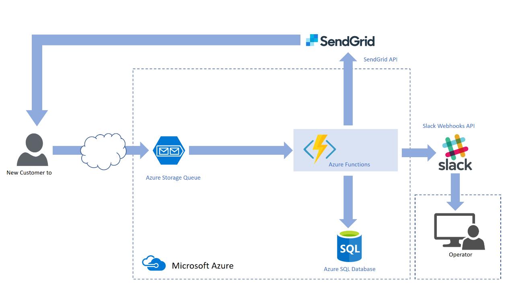
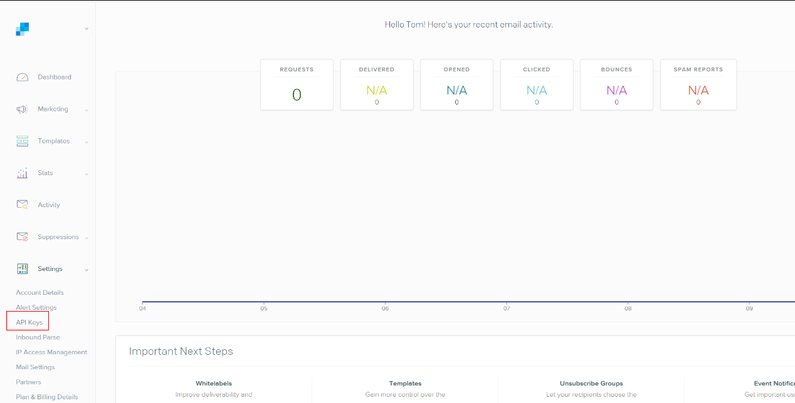
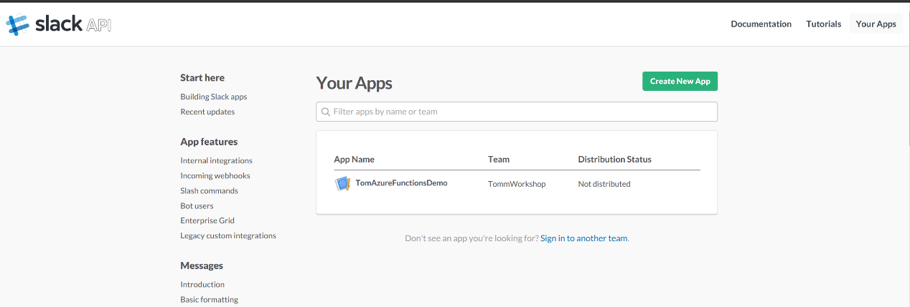
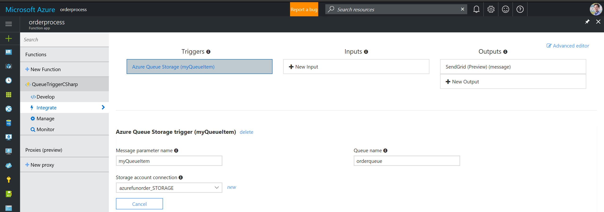
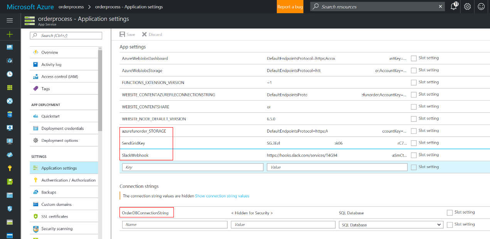

### Proof of concept - Azure Functions

Azure Functions is design for a serverless application architecture, it allows
an application function trigger by specific event, where some amount of
server-side logic is still written by C\# and node.js. Azure Functions only
charge by function execution time unlike traditional architectures is running in
a 7x24 dedicated server.

The code is coming from a proof of concept, to make sure Azure Functions can
meet these technical requirement:

-   Handle JSON format order information.

-   Supports trigger for Azure Storage queues.

-   Azure Function can insert order data into Azure SQL Database

-   Azure Function can be integrated with SendGrid API for sending confirmation
    email to customer.

-   Azure Function can be integrated with Slack Webhooks API for communication.

The high-level architecture diagram as below:



The Azure Function can process an Order message JSON format like this:
```json
{
  "Name":"Tom Lee",
  "Email":"tomlee@contoso.com",
  "Item":"A1 Business Cloud"
}
```

### Requirements

-   Prepare a SendGrid account and create an API key



-   Create a team on Slack and register an application for Slack Webhook API



-   Creates an Azure SQL Database with a table name **OrderInfo**

-   Creates an Azure Storage Queue named **orderqueue**

-   Creates an Azure Functions and setting the application





**azurefunorder\_STORAGE** : Azure Storage Queue access key

**SendGridKey** : SendGrid API Key

**SlackWebhook** : Slack Webhooks URI

**OrderDBConnectionString** : Azure SQL Database ADO.NET connection string
